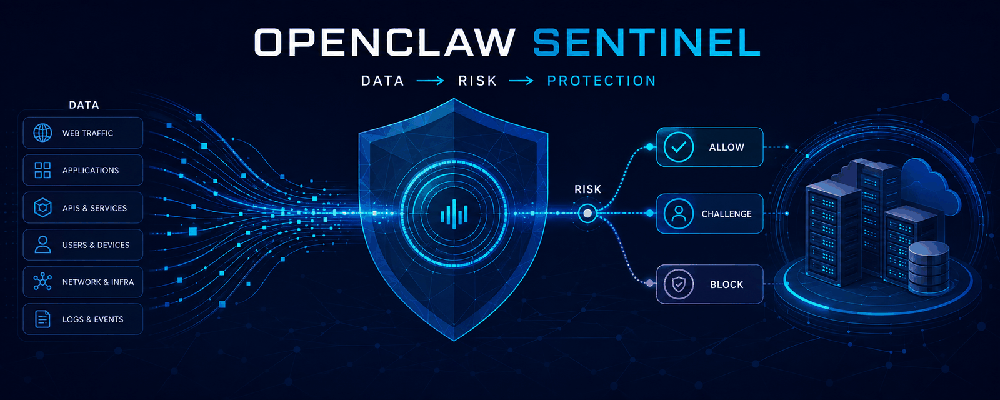

<div align="center">
  
  <h1>OpenClaw Sentinel</h1>
  <p><strong>Security intelligence for observable, policy-driven protection.</strong></p>
  <p>
    <a href="https://github.com/lesecuritae/openclaw-sentinel/actions/workflows/ci.yml"></a>
    <a href="LICENSE"></a>
    
  </p>
</div>



OpenClaw Sentinel is a modular, self-hosted security intelligence platform. It exists to connect
security observations with explainable risk analysis and controlled response without coupling
every data source directly to a firewall or proxy.

Sentinel is **not a traditional firewall**. It is the intelligence layer between data sources,
risk analysis and independently configured actions. It normalizes events, evaluates YAML rules,
calculates an explainable score, applies policy, preserves security memory and delegates any
enforcement to a least-privilege provider.

## Architecture

```text
HAProxy runtime socket --------> collector -> normalizer -> event store -> detection -> risk -> policy
HAProxy JSON logs / SPOE ------^                                      | allow
                                                                    | Anubis challenge
                                                                    ` HAProxy block
Security memory <-> REST/MCP <-> advisory LLM gateway <-> local model or OpenRouter
```

See [architecture](docs/architecture.md), [security model](docs/security-model.md), and
[plugin contracts](docs/plugins.md) for the trust boundaries and planned providers.

## Quick start

```bash
cp .env.example .env
docker compose up -d --build
curl http://127.0.0.1:8080/health
```

The standalone configuration starts successfully without HAProxy and binds only to localhost.
Set a long `SENTINEL_API_KEY` before exposing the API. Requests to all endpoints except health
then require `Authorization: Bearer <token>`. No secret belongs in Git; `.env` is ignored.

Submit a normalized request event (also the HTTP boundary for an SPOE forwarder):

```bash
curl -X POST http://127.0.0.1:8080/events \
  -H 'Content-Type: application/json' -H 'Authorization: Bearer TOKEN' \
  -d '{"source":"haproxy","ip":"192.0.2.10","hostname":"app.example.org","service":"application","event_type":"request","path":"/login","method":"POST","user_agent":"example-client/1.0","severity":"medium","metadata":{"status":401,"frontend":"public","backend":"application"}}'
```

Ready-to-send canonical and collector-level payloads are provided under `examples/`.

## HAProxy setup

Create an empty persistent ACL file on the HAProxy host, configure the administrative runtime
socket, and reject matching clients in the relevant frontend:

```haproxy
global
  stats socket /run/haproxy/admin.sock mode 660 level admin

frontend public
  acl sentinel_blocked src -f /etc/haproxy/sentinel-blocklist.lst
  http-request deny deny_status 403 if sentinel_blocked
```

HAProxy must load the file once during configuration deployment. Afterwards Sentinel uses
`add acl` and `del acl` over the runtime API; it never restarts HAProxy. Grant the container
access to the socket deliberately, then start with the override:

```bash
docker compose -f docker-compose.yml -f docker-compose.haproxy.yml.example up -d --build
```

`ACTIONS_ENABLED=false` is the safe default. Enable it only after verifying the socket,
administrative permissions, ACL path, and recovery access. Source IPs are validated before a
runtime command is formed.

### Request event pipeline

Runtime `show sess` supplies active client/session data and `show stat` supplies aggregate
status/error counters. For request-level data, Phase 1.5 accepts one JSON object per UDP datagram
on port 1514. The decoder also accepts a normal syslog prefix before the JSON object. Enable
`HAPROXY_REQUEST_COLLECTOR_ENABLED=true`; keep `HAPROXY_REQUEST_BIND` on a trusted interface and
restrict the port by firewall. A representative HAProxy configuration is:

```haproxy
global
  log 127.0.0.1:1514 local0

defaults
  mode http
  option httplog
  log global
  log-format '{"timestamp":%Ts,"ip":"%ci","hostname":"%[req.hdr(host),json(utf8s)]","method":"%HM","path":"%HP","status":%ST,"frontend":"%ft","backend":"%b","service":"%b","user_agent":"%[req.hdr(user-agent),json(utf8s)]"}'
```

When HAProxy is outside Docker, point its syslog target at the configured host/bind address rather
than the example loopback address. UDP transport is intentionally optional; a reliable local
syslog relay can forward the same JSON payload. The decoder requires IP, method, path and status,
then normalizes hostname, frontend, backend, user agent and timestamp. `country` and `asn` are
nullable schema fields reserved for a future enrichment provider—there is no GeoIP lookup now.
The existing authenticated `/events` endpoint accepts the same canonical event as a reliable
SPOE/log-forwarder integration boundary. Aggregate events without an IP are stored but never
trigger an IP action.

## Rules and policy

Detection is configured in [config/rules.yaml](config/rules.yaml): event type, status, path,
HTTP method, threshold, distinct field, time window, and score are data—not embedded thresholds.
Rules cover known scanner paths, repeated POSTs to login endpoints and multiple different scanner
paths from one IP in 60 seconds. Policy thresholds and
provider switches live in [config/policy.yaml](config/policy.yaml). Phase 1 executes allow/block.
The challenge decision and `actions/anubis` provider boundary exist, but challenge routing is
disabled until an external Anubis deployment is configured in a later phase.

Security memory is SQLite in the `sentinel-data` volume. It stores every request field, event risk
score, per-IP profiles including score reasons, and action audit records. Existing Phase 1
databases are migrated additively at startup. Extension protocol `RiskFactorProvider` is the boundary for future threat
feeds, ASN/geo reputation, history, fingerprints and ML-derived factors.

## LLM and MCP

`LLM_PROVIDER` supports `disabled` (default), `local`, or `openrouter`. Local mode expects an
OpenAI-compatible `/v1/chat/completions` endpoint. OpenRouter requires `OPENROUTER_API_KEY` and
`MODEL`; neither is stored in the database or repository. Event content is explicitly wrapped as
untrusted data, but operators should still use a suitably isolated model. LLM output is advisory:
it cannot choose policy outcomes or invoke HAProxy, challenge, firewall, or cloud actions.

The authenticated `/mcp` endpoint implements the Phase-1 JSON-RPC boundary with these tools:

- `security.check_ip`
- `security.get_events`
- `security.get_incidents`
- `security.get_risk_score`
- `security.explain_event`
- `security.generate_report`

It provides MCP initialize, tools/list and tools/call primitives. Production streaming transports,
authorization scopes and richer report resources are roadmap work.
See [LLM and MCP integration](docs/llm-mcp.md) for OpenClaw, OpenWebUI and other clients.

## Threat intelligence

Phase 2 adds optional Spamhaus, abuse.ch ThreatFox, DShield and blocklist.de reputation signals,
backed by a local SQLite TTL cache. GeoIP and ASN enrichment have provider boundaries but perform
no lookup yet. Providers normalize evidence; they cannot call policy or action adapters. The Risk
Engine combines their weighted results with local scanner, request-rate and login evidence while
retaining every factor and reason. One feed alone is capped below the block threshold.

All external providers are disabled by default. Enable only necessary sources in
`config/intelligence.yaml`, set `ABUSECH_AUTH_KEY` through the environment when required, and
review each provider's terms. Sentinel never queries non-global IPs and never forwards raw feed
records to an LLM. See [Threat intelligence](docs/threat-intelligence.md) for configuration,
privacy controls, upstream documentation and custom-provider guidance.

## Adaptive risk intelligence

Phase 3 adds deterministic request-pattern, geo/time and client-change analysis to the live risk
path. Safe observations build bounded per-device profiles and service baselines. Profiles start at
a neutral trust score of 50 and require at least ten consistent, sufficiently confident samples
before trust can lower risk. Challenged, blocked or otherwise risky requests never build positive
trust.

Every anomaly is stored with its event, source, score, reason and factor kind. Missing country,
timezone or client attributes stay neutral; Sentinel does not infer fingerprints or block by
country. Adaptive components only produce evidence for the Risk Engine and never rewrite rules.
The MCP interface exposes read-only profile, anomaly and trust inspection tools. See
[architecture](docs/architecture.md) and [privacy](docs/privacy.md) for details.

## Web dashboard and API

Phase 4 serves a React dashboard at `http://127.0.0.1:8080/`. It provides current risk and
24-hour totals, live WebSocket events, incidents, IP history, HAProxy state, challenge/LLM/MCP
status, and validated editors for policy and threat-intelligence configuration. The API is under
`/api/v1`; live events use `/api/v1/ws/events` and authenticate with the API key in the first
WebSocket frame. The browser keeps that key in memory rather than persistent web storage.

Set `SENTINEL_API_KEY` before making the service reachable beyond localhost. Cross-origin browser
access is denied unless exact origins are listed in `CORS_ORIGIN_ALLOWLIST`; same-origin dashboard
access needs no CORS setting. Configuration updates reject unknown fields, validate thresholds,
and replace YAML files atomically. A successful update reports that Sentinel must be restarted
before the new engine configuration is active. See [Phase 4 backend](docs/backend/phase4.md).

## Security model

Safe defaults matter because Sentinel can sit near enforcement infrastructure. Automatic actions
and collectors are opt-in, the API binds to loopback, the container drops Linux capabilities, and
provider credentials come only from environment configuration. Deploy behind TLS, authenticate
the API, isolate the HAProxy socket, restrict UDP ingestion to trusted senders, and retain an
independent recovery path. See [SECURITY.md](SECURITY.md) before production use or vulnerability
reporting.

## Extending Sentinel

Interfaces are available for collectors, threat-intelligence enrichment, actions, external
challenges and LLM providers. Planned sources include Nginx, Linux, Windows, Docker and cloud
events. Phase 2 targets Spamhaus, abuse.ch, DShield, GeoIP, ASN reputation and VPN/Tor signals.
Extensions remain explicitly registered and configured; event input never loads executable code.

## Development and tests

```bash
python -m venv .venv
. .venv/bin/activate
pip install -e '.[test]'
ruff check .
pytest
cd frontend && npm ci && npm run lint && npm test && npm run build && cd ..
docker compose config
docker compose build
```

Tests cover structured request decoding, persistence, scanner/login detection, distinct paths,
scoring, policy boundaries, simulated HAProxy collection, runtime ACL blocking, input rejection,
dashboard/API authorization, configuration safety, bounded WebSocket delivery and an LLM provider
mock. GitHub Actions runs Python and frontend lint/tests/builds plus a Docker build on pushes and
pull requests.

## Roadmap

- Reliable syslog relay/SPOE adapter and additional Linux, Windows, Docker and Kubernetes sources
- VPN/Tor signals and production GeoIP/ASN enrichment
- Production Anubis routing and challenge-result feedback
- MCP streaming transport, scoped credentials and incident/report resources
- Audited rule suggestions, optional ML and learning models (never autonomous by default)

## License and community

OpenClaw Sentinel is licensed under [Apache License 2.0](LICENSE). Apache-2.0 was selected over
AGPL-3.0 to encourage broad use and integration across self-hosted, proxy and infrastructure
projects while retaining attribution, license notices and an explicit patent grant. Contributions
are welcome under [CONTRIBUTING.md](CONTRIBUTING.md) and the
[Code of Conduct](CODE_OF_CONDUCT.md). Changes are tracked in [CHANGELOG.md](CHANGELOG.md).
